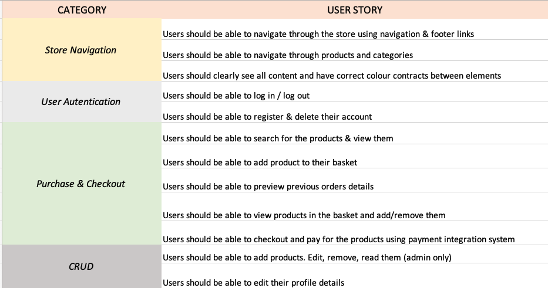
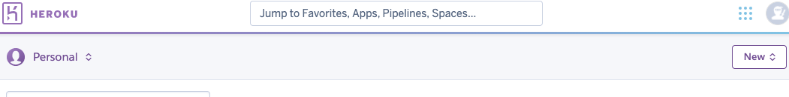
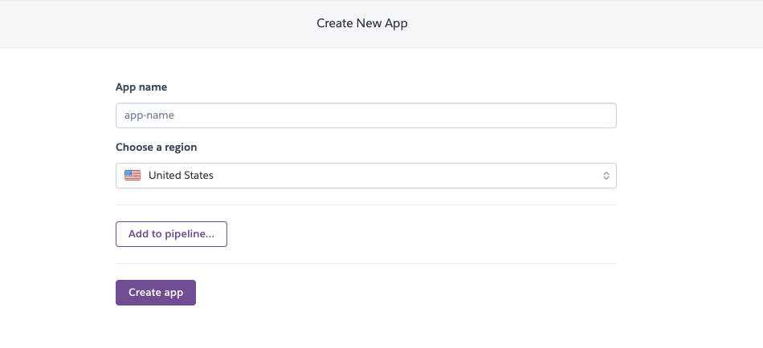
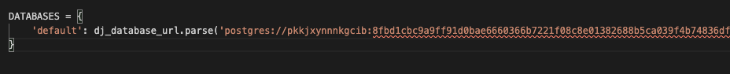
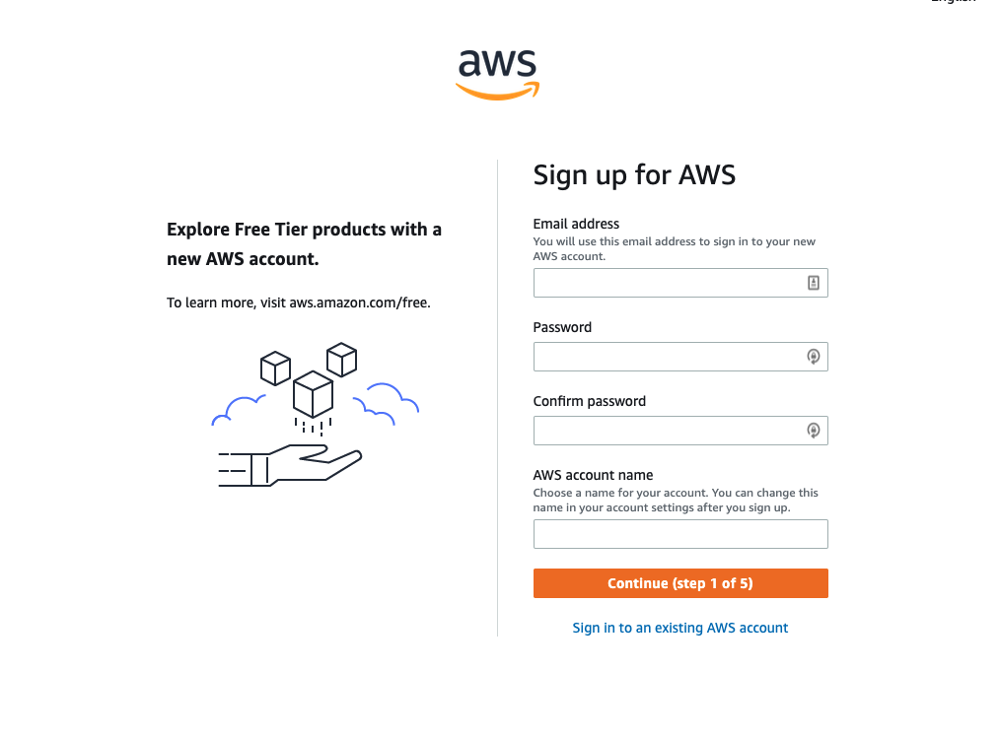
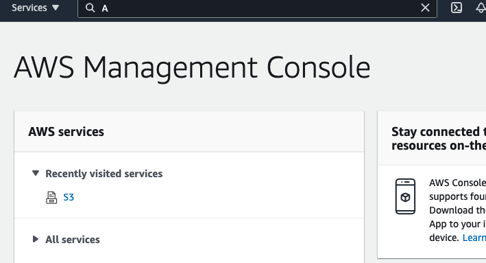
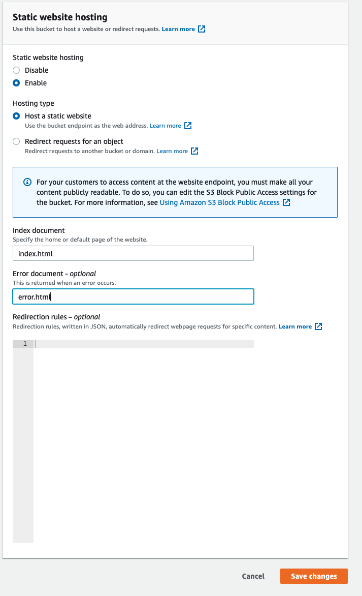
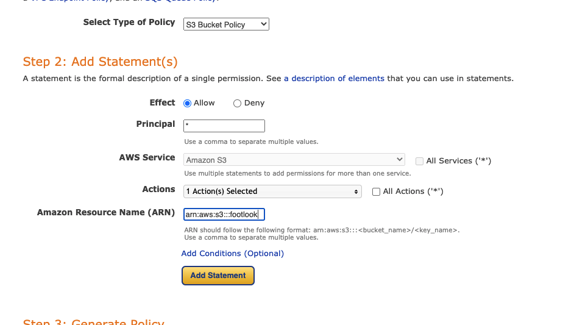
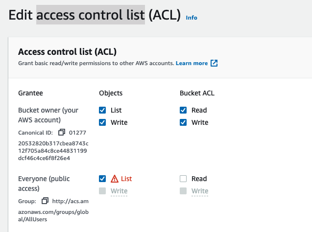
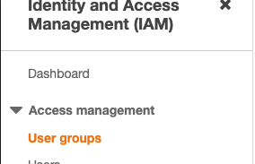

# FOOTLOOK

## Project Overview

Footlook is an e-commerce website selling footware for both Men & Women. Our shoe selection consists of Adidas shoes only and spans over three sub-brands. Our primary goal is to offer a user seemles buying journey with rich content & simple to use online platform.
We offer all our users ability to preview their orders and securely checkout out with their preferred shoes. 

### **The live site can be viewed [here](https://jobbing-hiring-app.herokuapp.com/)**.
     

# **Table Of Contents:**

- **UX**

  - Research and Analysis Phase
    - Business decision, long-term goals
    - User Stories
  - Design Phase

    - Sitemap
    - Colour pallet & Typography
    - Wireframes

  - **Features & Layout**

    - Homepage
    - Contact Us
    - Find a Job page
    - Login page
    - Register page
    - Profile page
    - Post a job page
    - Edit a job page

  - **Acknowledgements**

- **Technologies & Resources Used**

  - Languages Used
  - Frameworks & Processors
  - Workspace, version control and Repository storage
  - Integrations
  - Resources & Media

- **Testing & Deployment**
  - Validation & API testing
  - Testing Users Stories
  - Database Accessing Test
  - Testing Responsiveness
  - Bugs
  - Deployment

# **UX**

The website is designed with simplicity & effectiveness in mind, allowing users to quickly preview desired products and checkout within minutes. All product content is clearley structured and very thorough. Design is very clear and consistent which helps the user to navigate through the website with ease. Upon each user action, system either informs them or asks for the premission (deleting product off the basket/checkout. Adding to basket etc.)

# **Research and Analysis Phase**

## **Brainstorming Ideas & User Stories**

For this project, I wanted to build an e-commerce website, but I was unsure at the start where to get the product data. After sucessfully finding shoes product data, I decided to create Adidas oriented footware shop. After some research on usual brand colours, and website funcitonality I decided to proceed with planning and wireframing/designing.

**Long term goals:**

- Allow users to log-in using social media accounts.
- Creating tracking system within the profile page
- Implementing auto-address plug in to help the users to quickly fill in their details
- Adding more products and batter filtering system (shoe color, size etc.)
- Real life inventory 

### **User Stories**

# **Design Phase**

## **Sitemap**

Sitemap creation allowed me to brainstorm website structure and decide which pages will be included - view [here](media/footlook-sitemap.png).

## **Colour palette & Typography**

Colour Pallet was determined while re-searching for usual brand colours and darker theme options. Typography was selected on purpose to display nice headings and clean body text.

## **Wireframes**

All wireframes were created in InVision Studio, and all of them were created as deatailed as possible to allow development/implementation phase to focus on code specifically. They can all be previewed here [here](media/wireframes).

## **Deployment**

### <ins>Deployment to Heroku</ins>

### 1. Setup files that Heroku needs to connect correctly:

requirements.txt: this files list all the dependencies you have installed on the project

Procfile: Heroku looks to know which file runs the app (delete the blank line at the bottom of Procfile as it may cause problems when running on Heroku).

### 2. Setup Process

Go to Heroku, once logged into your dashboard, under New select ‘Create new app’:

Create app name (name must be unique, I would recommend using minus symbol instead of spaces.
Choose the closest region to you & create the app.

Navigate to resources tab and select Heroku Postgres under "Add-ons". 

Return back to your gitpod console and install dj_database_url & psycopg2-binary

pip3 install dj_database_url 

pip3 install psycopg2-binary  (remember to freeze the requirements pip3 freeze > requirements.txt)

Afterwards, navigate to settings.py. Import dj_database_url & comment out default databse settings, replacing them with postgres database.
You can grab database URL from heroku app under "settings" > reveal config vars > DATABASE_URL

Afterwards,  run migrations with gitpod command line. Load fixtures & create a superuser.

Back in your settings.py, implement if/else to show correct database based on current hosting & install gunicorn with pip command

Navigate to you gitpod command and log in to heroku using heroku login. After logging in disable static file collecting
heroku config:set DISABLE_COLLECTSTATIC=1 --app yourappname

Lastly, add allowed hosts to settings.py & deploy app

ALLOWED_HOSTS = ['yourappname.herokuapp.com', 'localhost']

To deploy app, commit and push all your files and the input git push heroku master

### 3. Setup automatic deployment from your GitHub repository:

Navigate to the Deploy tab within Heroku, select GitHub as deployment method.

Ensure your GitHub profile is displayed and search for the desired repository. If the wanted repo is visible in the list, select "Connect". The select enable automatic deployment

Click on the ‘Settings' tab, navigate to web and search for django secret key generator, after taking one paste it in your Config Vars back in Heroku under name "SECRET_KEY"

### <ins>Static file hosting with AWS</ins>

### 1. Creating account & setup

Navigate to aws.amazon.com & create an account

After creating an account, navigate to AWS Management Console and under Services tab search for S3

Create a new bucket, with all relevant details, ensure you uncheck "Block all public access" & select create bucket at the end of the page.

Afterwards, click into your newly created bucket and under properties tab search for Static website hosting end enable it with filling index.html & error.html to it's respective fields.

Next, navigate to premission > Cross-origin resource sharing and copy-paste the below code to the empty block: (note, this can be different in future so please ensure you are using the correct properties)

{
    "Version": "2012-10-17",
    "Id": "Policy1630364124616",
    "Statement": [
        {
            "Sid": "Stmt1630364121330",
            "Effect": "Allow",
            "Principal": "*",
            "Action": "s3:GetObject",
            "Resource": "arn:aws:s3:::footlook/*"
        }
    ]
}

Afterwards, go to Bucket policy, select edit > policy generator, ensuring you fill in all the fields like below & generate policy (you can find your ARN inside bucket policy):

Ensure you add slash key onto the end of the resource key.

Lastly navigate to Premission > Access control list and tick list under Everyone (public access)

### 2. Adding a user

Navigate back to the dashboard > services > IAM

Create a group for users

Afterwards, navigate to Policies > Create Policy > JSON tab > import managed policy (search for S3 and import S3 full access policy).

Grab bucket ARN from bucket policy in S3 service and paste to "Resource" back in JSON tab. Preview the policy by filling in name and description & create policy at the end.

Navigate back to Groups > your-group > attach policy & select created one and attach it to the premission policies.

Lastly, navigate to users tab > create user > fill in name and choose Programmatic access under Access type, and put them to the relevant group. Download csv file containing users access and secret keys. (Make sure you save the file securely as it WON'T be possible to download it again after completing the process).

### <ins>Connecting S3 bucket to django</ins>

Install boto3 & djnago storages with pip command, and add 'storages' to the list of installed apps in settings.py

Add bucket config to settings.py, and add AWS_ACCESS_KEY_ID & AWS_SECRET_ACCESS_KEY from downloaded file to heroku config vars.
Also add USE_AWS and set it to True

|**Key**|**Value**|
|:-----|:-----|
|AWS_STORAGE_BUCKET_NAME|`variable goes here`|
|AWS_S3_REGION_NAME|`variable goes here`|
|AWS_ACCESS_KEY_ID|`added by Heroku when Postgres installed`|
|AWS_SECRET_ACCESS_KEY|`variable goes here`|
|AWS_S3_CUSTOM_DOMAIN|`variable goes here`|

Create seperate python file and add 2 custom clases (media & static ) for storage location
Add Below to settings.py

|**Key**|**Value**|
|:-----|:-----|
|STATICFILES_STORAGE|`file.className`|
|STATICFILES_LOCATION|`folder name`|
|DEFAULT_FILE_STORAGE|`file.className`|
|MEDIAFILES_LOCATION|`folder name`|

Lastly, override current STATIC & MEDIA URL

|**Key**|**Value**|
|:-----|:-----|
|STATIC_URL|`f'https://{AWS_S3_CUSTOM_DOMAIN}/{STATICFILES_LOCATION}/'`|
|MEDIA_URL|`f'https://{AWS_S3_CUSTOM_DOMAIN}/{MEDIAFILES_LOCATION}/'`|

