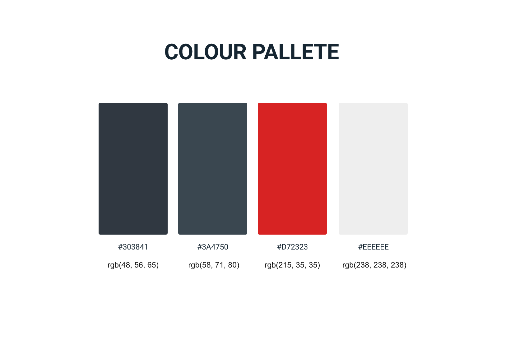
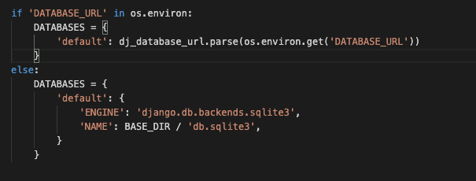

# FOOTLOOK

## Project Overview

Footlook is an e-commerce website selling footware for both Men & Women. Our shoe selection consists of Adidas shoes only and spans over three sub-brands. Our primary goal is to offer a user seemles buying journey with rich content & simple to use online platform.
We offer all our users ability to preview their orders and securely checkout out with their preferred shoes. 

### **The live site can be viewed [here](https://footlook.herokuapp.com/)**.

## **Login credentials for the website:**

### _Admin_

username: admin

Password: Delta2021!

email: someemail@email.com

### _Basic User_

username: basicuser

password: Delta2021!

email: otheremail@email.com

# **Table Of Contents:**

- **UX**

  - Research and Analysis Phase
    - Business decision, long-term goals
    - User Stories
  - Design Phase

    - Sitemap
    - Colour pallet & Typography
    - Wireframes

  - **Features & Layout**

    - Homepage
    - Contact Us
    - Find a Job page
    - Login page
    - Register page
    - Profile page
    - Post a job page
    - Edit a job page

- **Technologies & Resources Used**

  - Languages Used
  - Libraries and Frameworks
  - Workspace, version control and Repository storage
  - Tools
  
- **Testing & Deployment**
  - Validation & API testing
  - Testing Users Stories
  - Database Accessing Test
  - Testing Responsiveness
  - Bugs
  - Deployment

- **Acknowledgements**

# **UX**

The website is designed with simplicity & effectiveness in mind, allowing users to quickly preview desired products and checkout within minutes. All product content is clearley structured and very thorough. Design is very clear and consistent which helps the user to navigate through the website with ease. Upon each user action, system either informs them or asks for the premission (deleting product off the basket/checkout. Adding to basket etc.)

# **Research and Analysis Phase**

## **Brainstorming Ideas & User Stories**

For this project, I wanted to build an e-commerce website, but I was unsure at the start where to get the product data. After sucessfully finding shoes product data, I decided to create Adidas oriented footware shop. After some research on usual brand colours, and website funcitonality I decided to proceed with planning and wireframing/designing.

**Long term goals:**

- Allow users to log-in using social media accounts.
- Creating tracking system within the profile page
- Implementing auto-address plug in to help the users to quickly fill in their details
- Adding more products and better filtering system (shoe color, size etc.)
- Real life inventory 

### **User Stories**

# **Design Phase**

## **Sitemap**

Sitemap creation allowed me to brainstorm website structure and decide which pages will be included - view [here](media/footlook-sitemap.png).

## **Colour palette & Typography**

Colour Pallet was determined while re-searching for usual brand colours and darker theme options. Typography was selected on purpose to display nice headings and clean body text.

## **Wireframes**

All wireframes were created in InVision Studio, and all of them were created as deatailed as possible to allow development/implementation phase to focus on code specifically. They can all be previewed here [here](media/wireframes).

[^ Back To Top ](#footlook)

# **Features & Pages**

The website consists of 8 unique pages:

- Homepage
- Category Page
- Product Detail Page
- Profile Page
- Checkout
- Checkout Success Page
- Allauth templates (signup, log-in, sign-out etc.)
- Add & Edit product page (storeowner only)

<ins>_Navigation_</ins>

The navigation bar consists of logo, category links (men, women & brands), search bar, basket & profile icons.

Profile icon shows login & register on hover if user is logged-out. Otherwise, it displays red circle to signal user is logged in and on click it redirects to the profile page.

Mobile version navigation has a company logo and hamburger menu with the same structure as large navigation. Additionaly it shows social icons & logout icon at the bottom left corner.

<ins>_Footer_</ins>

Footer consists of quick links & shop links (categories & brands). It also has newsletter signup, social icons, copyright bar and accepted cards icons.

<ins>_Homepage_</ins>

The homepage is divided into four sections:

- _Hero Section_: This consists of the background image, title, subtitle, call to action (shop now) and social icons.
- _New Arrivalse_: This section showcases a carousel with 10 new arrivals where users can click into a desired product.
- _Testimonials_: This consists of three top testimonials and it servers great as a trust builder.
- _Shop By Category_: This section emphasizes shopping accross different categories.

<ins>_Category Page_</ins>

Brands are display at the top of the page enabling users to shop for a specific brand.
Underneath, users can find total product found statement and filtering system from which they can sort products by rating, price (low-high) & vice versa.

Below the two, users can find a list of products which changes based of the way users shop.

<ins>_Product Detail Page_</ins>

This page consist of all product details.
Primary and additional images. Brand logo, title, rating, sku, available sizes, description, rrp & current price. Add to bag CTA & product management (only for storeowners)

Product management enables storeowners to edit a product or remove it. By selecting remove button. Confirmation module is launched to double-check if users are sure to proceed and prevent accidental click.

<ins>_Profile Page_</ins>

Top bar shows users username, signout button & product management CTA (only for storeowners, this button leads to 'add a product' form).
Below, user can preview & edit their Personal & Shipping details. 

At the form submission for personal details,
below checks are made:

1. if the username exists already (Django returns the error meassage).
2. if the same username used (Django returns warning message).
3. if empty string is posted (Javascript validation not allowing users to submit empty form, in case that fails Django will return error message).

At the form submission for shipping details, below checks are made:

1. If any of the feilds except address line 2 and phone number are submitted (Django returns an error message).
2. If default contry text is submitted (Django returns an error message).

Underneath user details, user can preview order history and by clicking more info, they can see detailed information in the pop-up.

Also, if users have shipping details saved they will be pre-filled in the checkout form allowing faster checkout.

Lastly, users have the option to delete their account by selecting delete button. Confirmation module is launched to double-check if users are sure to proceed and prevent accidental click.

<ins>_Basket sidebar_</ins>

Basket sidebar is available across the store. If there are products in the basket, it cotains of total product count, added products and their details, delivery charge, basket subtotal and checkout CTA. If there are no products in the basket, message 'no products in the basket' is displaying togeather with shop by category and brand links.

Basket is created in a way to allow users to edit quantities & remove products without refreshing the page which is all submitted with Ajax and available instantly.

<ins>_Checkout page_</ins>

This page consist of header with Secure checkout title & back to shopping CTA.

Two sections:

- User shipping details form, payment box.
- Order brakedown with subtotal, delivery charge & order total.

Users also have the option to save the delivery details to their profile (if logged-in) or create account / sign-in if logged-out.

Upon placing order, users are presented with loading animation to inform them that order is processing. In case order form fails or users close their browser or refresh webooks are handling the order creation and ensuring everything still works.

<ins>_Checkout success_</ins>

This page consists of order confirmation message, order details, products ordered details & customer details. 

<ins>_Allauth User Autentication pages_</ins>

All the pages are populated with allauth package. Bespoke styling has been added to all templates to match with the current store theme.

<ins>_Add/Edit pages_</ins>

Both pages consist of the same form, but the difference is in the logic. Add a product form is empty and it's allowing the storeowner to add new products to the store.

Edit a product form is prepopulated with the selected product (accessing through product detail page) allowing users to change current product.

[^ Back To Top ](#footlook)

# Technologies Used

## Languages
- [CSS3](https://developer.mozilla.org/en-US/docs/Web/CSS)
- [HTML5](https://developer.mozilla.org/en-US/docs/Web/HTML)
- [Javascript](https://developer.mozilla.org/en-US/docs/Web/JavaScript)
- [Python](https://www.python.org/)

## Libraries and Frameworks 

### Front-End Technologies
- [jQuery](https://jquery.com/) 
- [Bootstrap](https://getbootstrap.com/)
- [Google Fonts](https://fonts.google.com/)   
- [Font Awesome](https://fontawesome.com/)
- [Jquery loading.js](https://carlosbonetti.github.io/jquery-loading/)
- [AOS.js](https://michalsnik.github.io/aos/)
- [Jquery validate.js](https://jqueryvalidation.org/)
- [Jquery confirm.js](https://craftpip.github.io/jquery-confirm/)

 
### Back-End Technologies
- [Django](https://www.djangoproject.com/)
- [Boto3](https://boto3.amazonaws.com/v1/documentation/api/latest/index.html) 
- [Pillow](https://pypi.org/project/Pillow/) 
- [Gunicorn](https://gunicorn.org/) 
- [Stripe](https://stripe.com/en-nl)

## Workspace, version control, repository storage & database

- [GitHub](https://github.com/)
- [GitPod](https://gitpod.io/)
- [Heroku](https://www.heroku.com)
- [Heroku PostgreSQL](https://elements.heroku.com/addons/heroku-postgresql)
- [AWS S3 Basket](https://docs.aws.amazon.com/cli/latest/userguide/cli-services-s3.html)

## Tools
- [Autoprefixer](https://autoprefixer.github.io/) 
- [InVision Studio](https://figma.com) 
- [Chrome Dev Tools](https://developers.google.com/web/tools/chrome-devtools)  
- [W3C Markup Validation Service](https://validator.w3.org/)  
- [W3C CSS Validation Service](https://jigsaw.w3.org/css-validator/)  
- [Am I Responsive?](http://ami.responsivedesign.is/) 
- [Canva](https://www.canva.com/)

[^ Back To Top ](#footlook)

## **Deployment**

### <ins>Deployment to Heroku</ins>

### 1. Setup files that Heroku needs to connect correctly:

requirements.txt: this files list all the dependencies you have installed on the project

Procfile: Heroku looks to know which file runs the app (delete the blank line at the bottom of Procfile as it may cause problems when running on Heroku).

### 2. Setup Process

Go to Heroku, once logged into your dashboard, under New select ‘Create new app’:

Create app name (name must be unique, I would recommend using minus symbol instead of spaces.
Choose the closest region to you & create the app.

Navigate to resources tab and select Heroku Postgres under "Add-ons". 

Return back to your gitpod console and install dj_database_url & psycopg2-binary

pip3 install dj_database_url 

pip3 install psycopg2-binary  (remember to freeze the requirements pip3 freeze > requirements.txt)

Afterwards, navigate to settings.py. Import dj_database_url & comment out default databse settings, replacing them with postgres database.
You can grab database URL from heroku app under "settings" > reveal config vars > DATABASE_URL

Afterwards,  run migrations with gitpod command line. Load fixtures & create a superuser.

Back in your settings.py, implement if/else to show correct database based on current hosting & install gunicorn with pip command

Navigate to you gitpod command and log in to heroku using heroku login. After logging in disable static file collecting
heroku config:set DISABLE_COLLECTSTATIC=1 --app yourappname

Lastly, add allowed hosts to settings.py & deploy app

ALLOWED_HOSTS = ['yourappname.herokuapp.com', 'localhost']

To deploy app, commit and push all your files and the input git push heroku master

### 3. Setup automatic deployment from your GitHub repository:

Navigate to the Deploy tab within Heroku, select GitHub as deployment method.

Ensure your GitHub profile is displayed and search for the desired repository. If the wanted repo is visible in the list, select "Connect". The select enable automatic deployment

Click on the ‘Settings' tab, navigate to web and search for django secret key generator, after taking one paste it in your Config Vars back in Heroku under name "SECRET_KEY"

### <ins>Static file hosting with AWS</ins>

### 1. Creating account & setup

Navigate to aws.amazon.com & create an account

After creating an account, navigate to AWS Management Console and under Services tab search for S3

Create a new bucket, with all relevant details, ensure you uncheck "Block all public access" & select create bucket at the end of the page.

Afterwards, click into your newly created bucket and under properties tab search for Static website hosting end enable it with filling index.html & error.html to it's respective fields.

Next, navigate to premission > Cross-origin resource sharing and copy-paste the below code to the empty block: (note, this can be different in future so please ensure you are using the correct properties)

{
    "Version": "2012-10-17",
    "Id": "Policy1630364124616",
    "Statement": [
        {
            "Sid": "Stmt1630364121330",
            "Effect": "Allow",
            "Principal": "*",
            "Action": "s3:GetObject",
            "Resource": "arn:aws:s3:::footlook/*"
        }
    ]
}

Afterwards, go to Bucket policy, select edit > policy generator, ensuring you fill in all the fields like below & generate policy (you can find your ARN inside bucket policy):

Ensure you add slash key onto the end of the resource key.

Lastly navigate to Premission > Access control list and tick list under Everyone (public access)

### 2. Adding a user

Navigate back to the dashboard > services > IAM

Create a group for users

Afterwards, navigate to Policies > Create Policy > JSON tab > import managed policy (search for S3 and import S3 full access policy).

Grab bucket ARN from bucket policy in S3 service and paste to "Resource" back in JSON tab. Preview the policy by filling in name and description & create policy at the end.

Navigate back to Groups > your-group > attach policy & select created one and attach it to the premission policies.

Lastly, navigate to users tab > create user > fill in name and choose Programmatic access under Access type, and put them to the relevant group. Download csv file containing users access and secret keys. (Make sure you save the file securely as it WON'T be possible to download it again after completing the process).

### <ins>Connecting S3 bucket to django</ins>

Install boto3 & djnago storages with pip command, and add 'storages' to the list of installed apps in settings.py

Add bucket config to settings.py, and add AWS_ACCESS_KEY_ID & AWS_SECRET_ACCESS_KEY from downloaded file to heroku config vars.
Also add USE_AWS and set it to True

|**Key**|**Value**|
|:-----|:-----|
|AWS_STORAGE_BUCKET_NAME|`variable goes here`|
|AWS_S3_REGION_NAME|`variable goes here`|
|AWS_ACCESS_KEY_ID|`added by Heroku when Postgres installed`|
|AWS_SECRET_ACCESS_KEY|`variable goes here`|
|AWS_S3_CUSTOM_DOMAIN|`variable goes here`|

Create seperate python file and add 2 custom clases (media & static ) for storage location
Add Below to settings.py

|**Key**|**Value**|
|:-----|:-----|
|STATICFILES_STORAGE|`file.className`|
|STATICFILES_LOCATION|`folder name`|
|DEFAULT_FILE_STORAGE|`file.className`|
|MEDIAFILES_LOCATION|`folder name`|

Lastly, override current STATIC & MEDIA URL

|**Key**|**Value**|
|:-----|:-----|
|STATIC_URL|`f'https://{AWS_S3_CUSTOM_DOMAIN}/{STATICFILES_LOCATION}/'`|
|MEDIA_URL|`f'https://{AWS_S3_CUSTOM_DOMAIN}/{MEDIAFILES_LOCATION}/'`|

Add AWS_S3_OBJECT_PARAMETERS to settings.py

if 'USE_AWS' in os.environ:
    # Cache control
    AWS_S3_OBJECT_PARAMETERS = {
        'Expires': 'Thu, 31 Dec 2099 20:00:00 GMT',
        'CacheControl': 'max-age=94608000',
    }

Navigate to S3 bucket > Objects tab > Create folder and add media folder, ensure all the files are uploaded. Under Access control list (ACL) select Grant public-read access and then upload.

As a last step, grab keys from STRIPE and add them to Heroku config vars

[^ Back To Top ](#footlook)