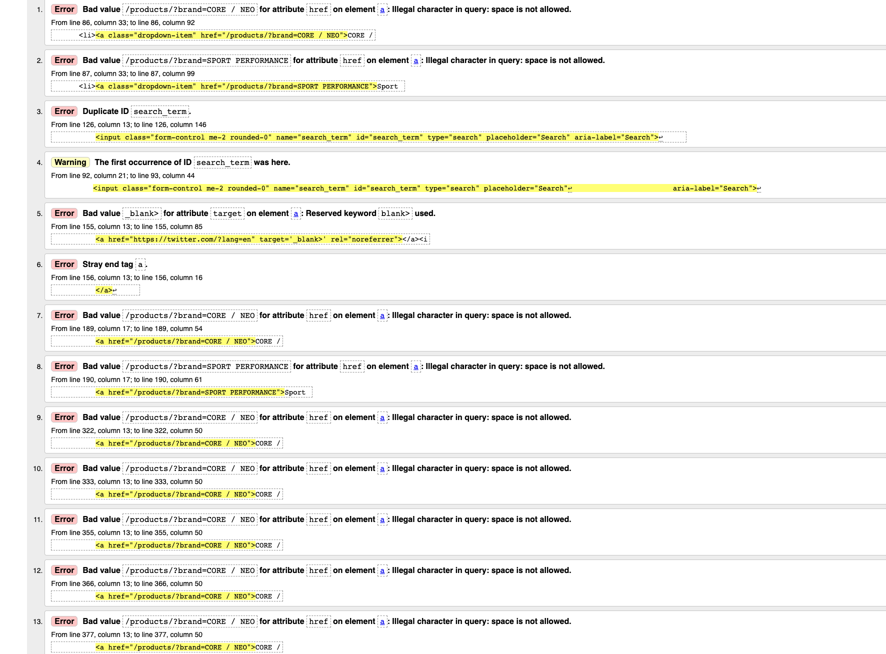
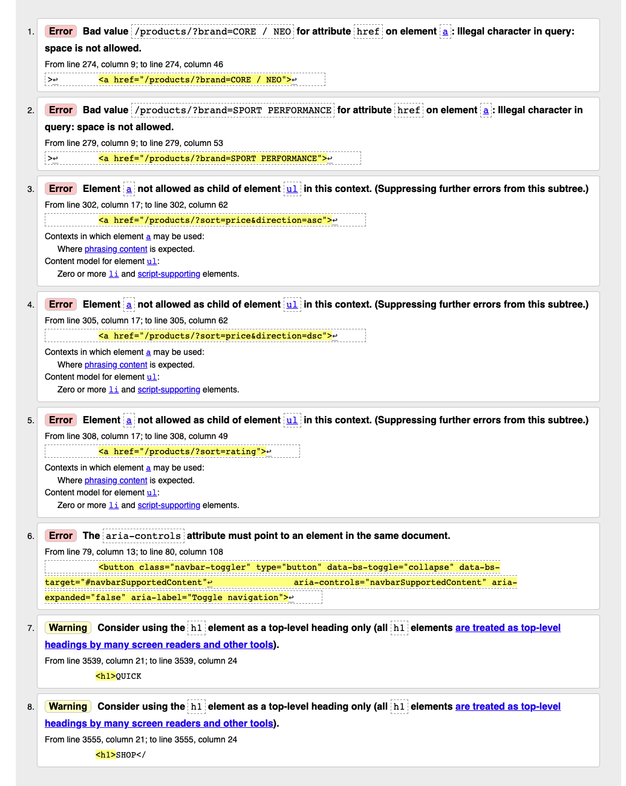
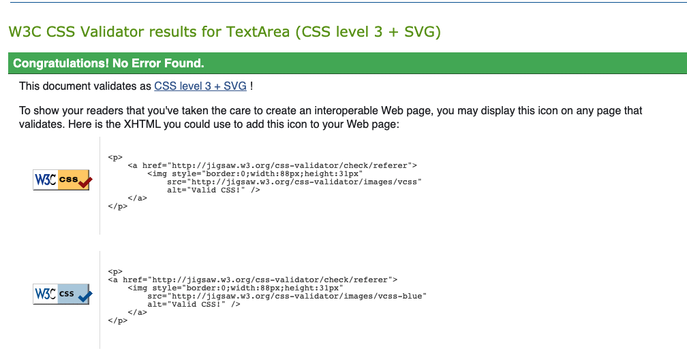
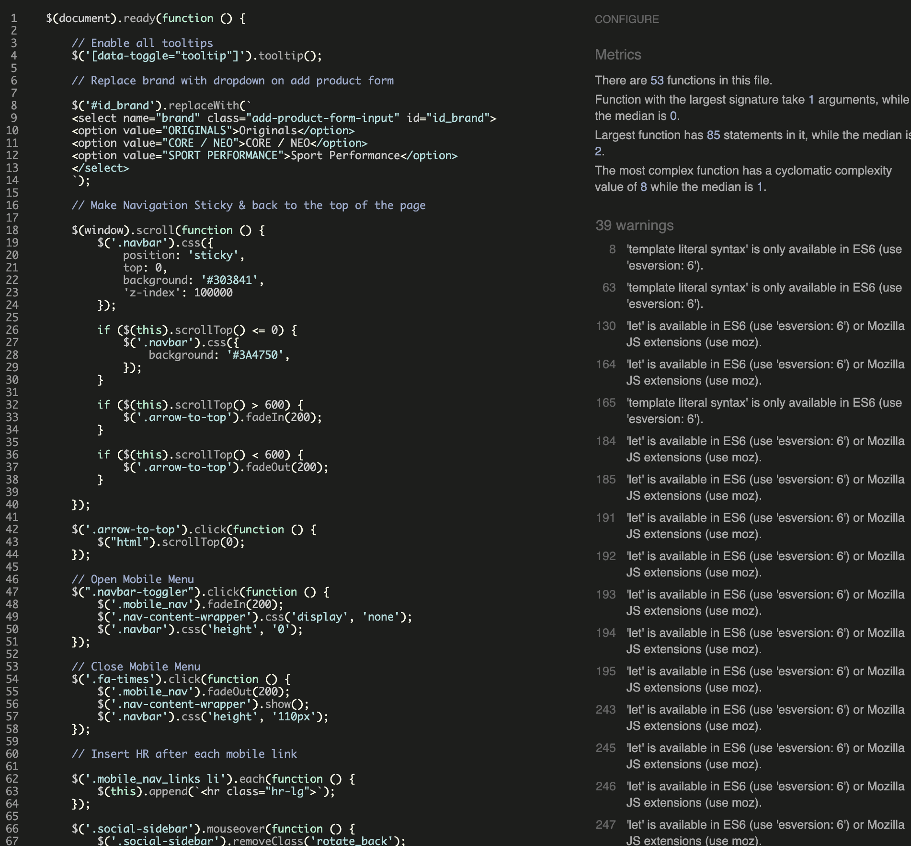

# Project Testing 
 
## **Table Of Contents:**
1. [Responsive Testing](#responsive-testing) 
2. [Validation Testing](#validation-testing) 
3. [Features Testing](#features-testing) 
4. [Bugs](#bugs) 
 

### **Responsive Testing**

- _Homepage_

#### Changes made on screens smaller then 750px

    - decreased hero text font-size
    - reduced width & height for shopping bag div
    - decreased price bubble size & font-size
    - Reduced product image under New arrivals section & next button font size and height
    - Decreased testimonial image width 
    - Enabled shop now button to be visible without hover within category boxes

- _Category Page_

Few minor tweaks made on category page to improve responsiveness

    -   Moved RRP to the top of product box
    -   Reduced product image to fit correctly on the page

- _Product Detail Page_

No changes required on this page. All the elements are fully responsive.

- _Basket Sidebar_

Couple of minor margin and padding changes on screen smaller then 550px. Changes to product box where images comes on the top and product detail goes underneat and acquires full width.

- _Checkout Page_

Small margin and padding changes in order details section. Image reduced by 50px to fit the space withou need to scroll

- _Checkout Sucess Page_

Small changes around product details section. Product info placed under image.

- _Allauth Pages_

#### Changes made on screens smaller then 500px

    - Removed absolute positioning & all its properties.
    - Made form content full width & removed border radius
    - Decresed font size and padding in why sign up section

- _Profile Pages_

#### Changes made on screens smaller then 500px

    - Moved product management to it's own line
    - Reduced font size of form labels
    - Changed order info popup to position absolute and set height to 100% to remove bug with visibility

### **Validation Testing**

#### **HTML Validation**

I used the [W3C Markup Validation Service](https://validator.w3.org/) to check the HTML of all URLs

- Homepage Validation_

Homepage returned a lot of errors mainly around spaces in href attribute and some typos

I managed to resolve all the errors.

- _Category Page Validation_

Category page returned a couple of errors regarding space in href atrributes & a tag not allowed to be child of ul tag

All the errors are resloved

- _Product Detail Page Validation_

No errors found on product details page

- _Checkout Page Validation_

No errors found on checkout page

- _Checkout Success Page Validation_

No errors found on checkout sucess page

- _Profile Page Validation_

No errors found on profile page

- Add/Edit Product Page Validation_

No errors found on both pages

#### **CSS Validation**

I used [W3C CSS Validation Service](https://jigsaw.w3.org/css-validator/) to check the CSS validity, the code passed the validator with no errors.

#### **JS Validation**

I used [JS Hint Validator](https://jshint.com/) to check the script files. No errors were highlighted, just warnings stating missing semicolons and warnings of template literal syntax being available in ES6.

#### **PYTHON Validation**

I have used Problems tab in command line to go through each file and check if Python is PEP8 compliant. In most files erros were 'line to long', 'line containing trialing space', 'no new line at the end of the file'. I managed to resolve most of the warnings and issues.

### **Features Testing**